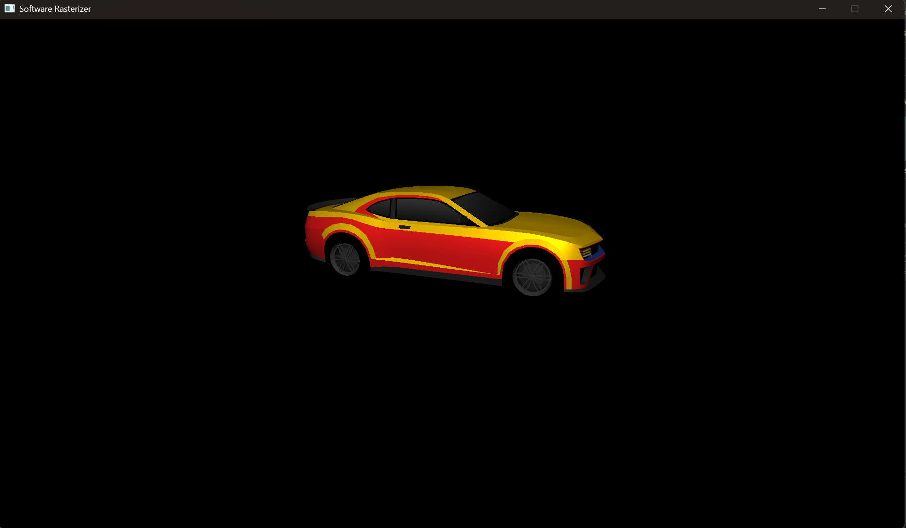
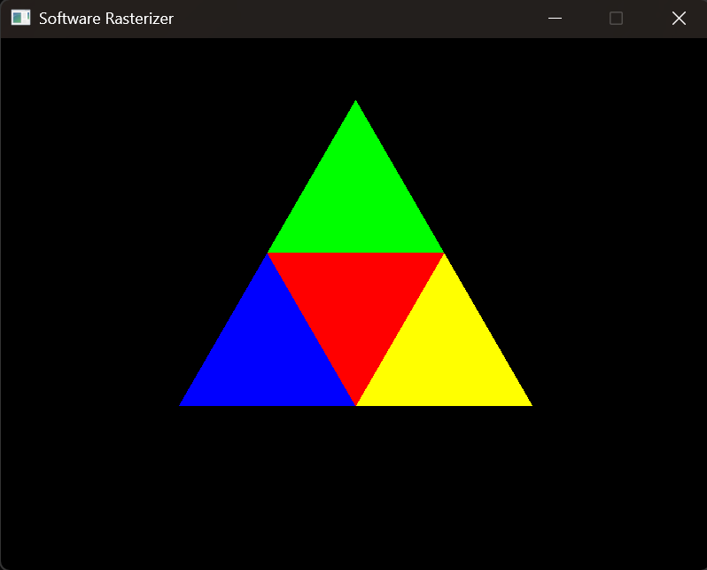
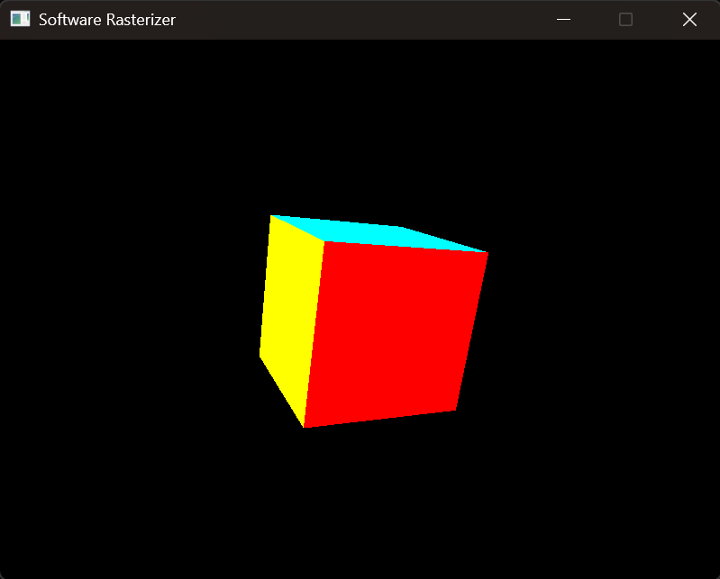
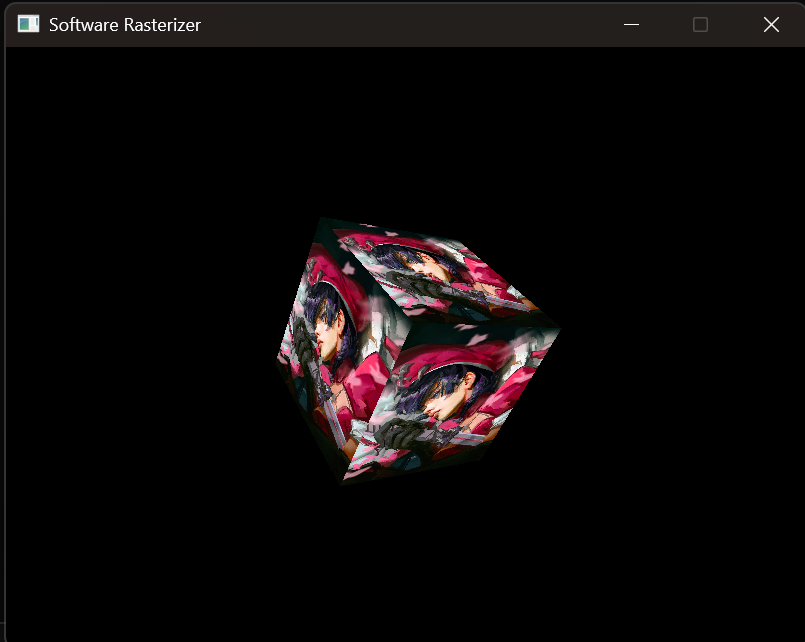
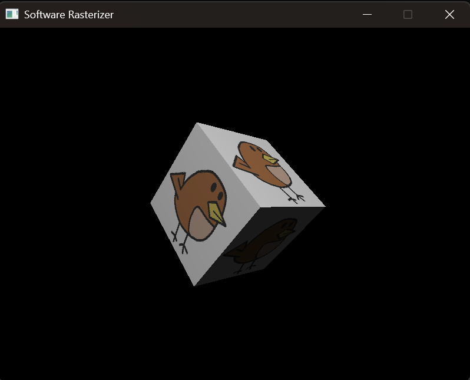

# Software Rasterizer

> This is a Practical Implementation of a **Software Rasterizer** created by me in C++.



> A CPU-only 3D rendering pipeline built from scratch in C++ — no OpenGL, no DirectX, no GPU. 
> Implements the full graphics pipeline: rasterization, Z-buffering, perspective-correct texture 
> mapping, and Blinn-Phong lighting, culminating in a textured, lit OBJ model rendered entirely on CPU.

## What is a Software Rasterizer ?
A **Software Rasterizer** is a graphics engine that renders 3D objects into 2D images using CPU instead of a dedicated Graphics Hardware (**GPU**).

## Project Requirements
**This Project uses these following API and Languages:** 
- **C++**
- **SDL3 (For Rendering)**

## Creating a Frame Buffer
### What is a Frame Buffer?
Your monitor displays a picture Bu Lighting up a grid of pixels. Something has to decide what that each pixel should be. That something is a **FrameBuffer**. It is a block of memory where each slot corresponds to one pixel on the memory.<br>
Think of it as a flat 1D array representing a 2D grid.<br>
`std::vector<uint32_t> m_buffer;`
>Pixel at (x,y) lives at index: `y * width + x`<br>

But Why `y * width + x` and not `x * Height + y`?<br>

Let's Assume pixel in a screen is a grid: <br>

| | x=0 | x=1 | x=2 | x=3 |
| :--- | :---: | :---: | :---: | :---: |
| **y=0** | [A] | [B] | [C] | [D] |
| **y=1** | [E] | [F] | [G] | [H] |
| **y=2** | [I] | [J] | [K] | [L] |
| **y=3** | [M] | [N] | [O] | [P] |


And Memory is stored in a single Continuous line: <br>

And memory is stored in a continuous line.

| Memory Index | 0 | 1 | 2 | 3 | 4 | 5 | 6 | 7 | 8 |
| :--- | :---: | :---: | :---: | :---: | :---: | :---: | :---: | :---: | :---: | 
| **Stored Pixel** | [A] | [B] | [C] | [D] | [E] | [F] | [G] | [H] | [I]

So to find [F] pixel in memory: <br>
x = 1 <br>
y = 1 <br>
Width = 4

> Formula: `y * Width + x`. <br>

1 * 4 + 1 = 5<br>
That's How we Get the memory block location.

## Pixel Format
>As I am using SDL For Display. I'll use SDL_PIXELFORMAT_ARGB8888.

`SDL_PIXELFORMAT_ARGB8888` and the framebuffer will be `uint32_t` a 32 bit unsigned integer. Which means 1 pixel will take 32 bits = 4 bytes.<br>

The Window Resolution is `800 x 600` So that Means a total of `480000 pixels`.<br>
1 pixel = 4 bytes<br>
480000 pixels = 480000 x 4<br>
480000 pixels = 1920000 bytes = 1.92 MB<br>

**The format ARGB8888 means:**
- A  → Alpha → 8 bytes
- R  → Red → 8 bytes
- G  → Green → 8 bytes
- B  → Blue → 8 bytes

So, `0xFFFF0000` is fully opaque, full red with no green or blue.<br>

## Bresenham's Line Algorithm
>The Bresenham's line Algorithm is a highly efficient rasterization method used in computer graphics to approximate a mathematical straight line on a discreate pixel grid.

The algorithm is based on the equation of the line: y = mx + c. where., $$m = \frac{\Delta y}{\Delta x}$$
is the Slope.<br>

## Functions 
### Clear Screen
The most Basic Operation in any renderer is clearing the framebuffer before drawing anything.<br>
>I'll use `std::fill` as it is the most clear and idiomatic way.

```
void clearbuffer()
{
	std::fill(m_buffer.begin(), m_buffer.end(), 0xFF000000);
}
```
### Set Pixel
It is the most Basic function of the framebuffer as to draw anything You will have to Set a pixel to a given color.<br>
```
void setPixel(int x, int y, uint32_t color) {
	if (x >= 0 && x < m_width && y >= 0 && y < m_height)
	{
		m_buffer[y * m_width + x] = color;
	}
}
```
### Draw Line
Draw Line is one of the most important function of the framebuffer as the first step to draw anything is to create a line.
```
void DrawLine(int x0, int y0, int x1, int y1, uint32_t color)
{
	bool steep = false;
	if (std::abs(x0 - x1) < std::abs(y0 - y1)) {
		std::swap(x0, y0);
		std::swap(x1, y1);
		steep = true;
	}
	if(x0 > x1) {
		std::swap(x0, x1);
		std::swap(y0, y1);
	}

	// as this is same for every line, we can calculate it once
	int dx = x1 - x0;
	int dy = y1 - y0;

  	// We use error term to decide when to step in y direction. The error term is the distance from the ideal line. When it exceeds a threshold (in this case, dx), we step in y direction and reset the error.
	int derror = std::abs(dy) * 2;
	int error = 0;


	int y = y0;

	for (int x = x0; x <= x1; x++) {
		if (steep) {
			setPixel(y, x, color); // if transposed, de−transpose 
		}
		else {
			setPixel(x, y, color);
		}

		// Update the error term and step in y direction if necessary
		error += derror;
		if (error > dx) {
			y += (y1 > y0 ? 1 : -1);
			error -= dx *2;
		}
	}
}
```

## Triangles
### Why Triangles?
>Every 3D Mesh (Characters, Objects, etc.) is stored as a list of triangles.

**Three Reasons:**

1. **Guaranteed Planarity:**  Three Points always define one flat plain. Four points might not. A Quad can bent. A Triangle can never. This makes lighting math exact.
2. **Guaranteed Convexity:** The Inside of a triangle is always convex shape. There are no caves or holes. This makes "Is this pixel Inside?" a Solvable problem with simple math.
3. **Hardware:** Every GPU in the world is build around the triangle as its atomic unit. Understanding Triangle Rasterization is understanding what GPU does.

### Filling the Inside of a Triangle

So, Now the Question is How do we fill every pixel inside a triangle?<br>
We have 2 main options:
- **Scan Lines**
- **Edge Function**

### Scan Lines
>for Each Horizontal rows of pixels the triangle touches, find where that triangles left right edges cross that row, then fill everything between them.

This works But it is Complicated to implement correctly(I did it some how and its working). You need to:
- Sort vertices by Y
- Handle the case where Horizontal edge exist
- Split the Triangle into a flat top and flat bottom part
- Track two Edge Slop simultaneously

**My Implementation:**
```
void DrawTriangle(Vector2<int> t0, Vector2<int> t1, Vector2<int> t2, uint32_t color)
{
	if (t0.y == t1.y && t0.y == t2.y) return;
	// Sort the vertices by y-coordinate ascending (t0.y <= t1.y <= t2.y)
	if (t0.y > t1.y) std::swap(t0, t1);
	if (t1.y > t2.y) std::swap(t1, t2);
	if (t0.y > t1.y) std::swap(t0, t1);

	int total_height = t2.y - t0.y;
	if (total_height == 0) return; // Prevent division by zero

	// We will iterate through each horizontal line of the triangle, calculating the intersection points with the triangle edges and filling in the pixels between those points.
	for (int i = 0; i < total_height; i++)
	{
		// Determine if we are in the upper or lower part of the triangle
		bool second_half = i > t1.y - t0.y || t1.y == t0.y;
		// Calculate the height of the current segment (upper or lower)
		int segment_height = second_half ? t2.y - t1.y : t1.y - t0.y;
		// Calculate the interpolation factors for the current y level
		float alpha = (float)i / total_height;
		float beta = (float)(i - (second_half ? t1.y - t0.y : 0)) / segment_height; // be careful: with above conditions no division by zero here
		// Interpolate the x-coordinates of the triangle edges
		int ax =				t0.x + (t2.x - t0.x) * alpha;
		int bx = second_half ? t1.x + (t2.x - t1.x) * beta : t0.x + (t1.x - t0.x) * beta;
		// Ensure ax is the leftmost point and bx is the rightmost point
		if (ax > bx) std::swap(ax, bx);
		// We are drawing a horizontal line from ax to bx at the current y level (t0.y + i)
		for (int x = ax; x <= bx; x++)
		{
			setPixel(x, t0.y + i, color);
		}
	}
}
```

### Edge Function

For Every Pixel, We run a test checking that the pixel is inside the triangle or not. If it is then we color it else we skip it. The Test is three simple Multiplications:
#### The 2D Cross Product
The two 2D Vector A and B. There cross product Gives a Scaler:<br>
`cross(A,B) = A.x * B.y - A.y * B.x `

The Sign of this will tell you:
- **Positive:** B is to the left of A
- **Negative:** B is to the right of A
- **Zero:** A and B are parallel (The point is Exactly on the edge)
  
### The Edge Function
For a Directed Edge From Point A To Point B and a test point P:

`E(P) = (B.x - A.x) * (P.y - A.y) - (B.y - A.y) * (P.x - A.x)`

This is just The cross Product of the edge vector (B - A) and the vector from point `A` to point `P`.<br>
The Sign will tell us which side of the directed edge `P` is on. If we define our triangle constantly `(say, always Counterclockwise: v0 → v1, v1 → v2, v2 → v0)`, then the point is inside the triangle if and only if all three edge functions return a value >= 0.


#### Winding Order
The edge function you define the edges. Go Counterclockwise and inside is positive Go Clockwise and inside is negative.

**Counterclockwise (CCW)**
- All three edge function positive = inside
- This is what i am using

**Clockwise (CW)**
- All three edge function negative = inside
 
#### The Bounding Box Optimization
We can't loop over every pixel on an `600x800` screen for every triangle. that's `480,000` pixels every triangle, which is absurd.

Instead, We will compute **axis aligned bound box** of the three vertices:
```
min_x = min(x0, x1, x2)
max_x = max(x0, x1, x2)
min_y = min(y0, y1, y2)
max_y = max(y0, y1, y2)
```

Final:
```
void DrawTriangle(Vector2<int> t0, Vector2<int> t1, Vector2<int> t2, uint32_t color)
{
	
	int min_X = std::min({ t0.x, t1.x, t2.x });
	int max_X = std::max({ t0.x, t1.x, t2.x });
	int min_Y = std::min({ t0.y, t1.y, t2.y });
	int max_Y = std::max({ t0.y, t1.y, t2.y });

	min_X = std::max(0, min_X);
	max_X = std::min(m_width - 1, max_X);
	min_Y = std::max(0, min_Y);
	max_Y = std::min(m_height - 1, max_Y);

	for (int y = min_Y; y <= max_Y; y++) {
		for (int x = min_X; x <= max_X; x++) {
			// Check if the point (x, y) is inside the triangle
			// Implementation for point-in-triangle check would go here
			if (isPointInTriangle(Vector2<int>(x, y), t0, t1, t2)) {
				setPixel(x, y, color);
			}
		}
	}
}


bool isPointInTriangle(Vector2<int> p, Vector2<int> a, Vector2<int> b, Vector2<int> c) {
	
	int e0 = (b.x - a.x) * (p.y - a.y) - (b.y - a.y) * (p.x - a.x);
	int e1 = (c.x - b.x) * (p.y - b.y) - (c.y - b.y) * (p.x - b.x);
	int e2 = (a.x - c.x) * (p.y - c.y) - (a.y - c.y) * (p.x - c.x);

	return (e0 < 0 && e1 < 0 && e2 < 0);

}
```
**Test Result:**<br>


## Barycentric Coordinates
When we Compute the three edge functions for a point P inside a triangle `v0, v1, v2`, we get three values: `e0, e1, e2`.

Divide Each by total area of triangle **(Which is just `e0+e1+e2` for a CCW triangle and `-(e0+e1+e2)` for a CW Triangle):**
```
w0 = e0 / e0+e1+e2
w1 = e1 / e0+e1+e2
w2 = e2 / e0+e1+e2
```
These are called **barycentric coordinates**. They have one critical property:<br>
`w0 + w1 + w2 = 1.0`  **always** <br>
and each weight is between 0 and 1 for any point inside the triangle.

**Why de we care?** Because these weight let us interpolate any values that lives at the vertices across the entire triangle surface. Color, Texture Coordinates, Normals, Depth anything.

## Painter's Algorithm
Now our rasterizer has no concept of depth. if we draw Triangle A and then Triangle B overlapping it, B wins not because B is closer to camera but because it was drawn last. This is called **Painters Algorithm.**

The **Painter's Algorithm** has one fatal flaw: it breaks when triangles partially overlap or intersect each other. There is no Draw order that produces a correct image when two triangles cross through each other in 3D space.<br>
The Z-Buffer Solves This Permanently.

## Z-Buffer
Run a second buffer along side our framebuffer. Same width, Same Height. One `float` per pixel instead of `uint32_t`.<br>
This buffer stores **the depth of the closest fragment that has been written to each pixel so far.**

Before writing anything, we ask: **"is what i am about to draw closer that what's already there?"**
- if **Yes** — write the color update the depth
- if **No** — discard, do nothing

```
for each pixel being rasterized:
      if fragment.depth < zbuffer[p];
        zbuffer[p] = fragment.depth;
        framebuffer[p] = fragment.color;
```

### Initialization
Our Z-buffer must be initialize before every frame. The question is: **with what value?**

Think about it this way. We want every first fragment to win its first depth test because nothing has been drawn yet. So you initialize every slot to the furthest possible depth the value that any real fragment will beat.<br>
if closer = smaller depth value:
```
std::fill(m_zbuffer.begin(),m_zbuffer.end(),std::numeric_limits<float>::max());
```
Every fragment depth will be less than max so the first fragment to touch any pixel will win. Subsequent fragment only wins if they are closer.

>If we initialize to zero and closer means smaller — no fragment will ever pass the test because no depth is less than zero(assuming positive depths). Everything gets discarded. Black screen. This the most common bug in Z-Buffer.

### Where Does Z value Come From?
We have 3 vertices each has Z value. We have a pixel p inside a triangle. What's the depth at p?

We Interpolate it from the vertex depth using [**Barycentric Coordinates**](#Barycentric-Coordinates):
```
depth_at_P = w0 * z0 + w1 * z1 + w2 * z2
```
Where `w0`, `w1`and `w2` are barycentric weights you compute from the edge functions.

### The Degenerate Triangle Problem
**So, here is the a Question what will be the area of a triangle whose all three vertices are collinear(on the same line)?** <br>

`Zero`

and you will be dividing by zero when calculating the barycentric coordinates.


```

struct BarycentricResults
{
	float w0, w1, w2;
	bool isInside = true;
	float depth;
};

void DrawTriangle(Vector3<float> t0, Vector3<float> t1, Vector3<float> t2, uint32_t color)
{
	
	int min_X = (int)std::floor(std::min({ t0.x, t1.x, t2.x }));
	int max_X = (int)std::ceil(std::max({ t0.x, t1.x, t2.x }));
	int min_Y = (int)std::floor(std::min({ t0.y, t1.y, t2.y }));
	int max_Y = (int)std::ceil(std::max({ t0.y, t1.y, t2.y }));

	min_X = std::max(0, min_X);
	max_X = std::min(m_width - 1, max_X);
	min_Y = std::max(0, min_Y);
	max_Y = std::min(m_height - 1, max_Y);

	for (int y = min_Y; y <= max_Y; y++) {
		for (int x = min_X; x <= max_X; x++) {
			// Check if the point (x, y) is inside the triangle
			// Implementation for point-in-triangle check would go here
			BarycentricResults bary = computeBarycentricCoordinates(Vector3<float>(x, y, 0), t0, t1, t2);

			if (bary.isInside) {
				if (IsUsingZBuffer) {
					// Perform Z-buffering check
					int bufferIndex = y * m_width + x;
					if (bary.depth < m_zbuffer[bufferIndex]) {
						m_zbuffer[bufferIndex] = bary.depth;
						setPixel(x, y, color);
					}
				} else {
					setPixel(x, y, color);
				}
				
			}
		}
	}
}


BarycentricResults computeBarycentricCoordinates(Vector3<float> p, Vector3<float> a, Vector3<float> b, Vector3<float> c) {
	BarycentricResults bary;
	float e0 = (b.x - a.x) * (p.y - a.y) - (b.y - a.y) * (p.x - a.x);
	float e1 = (c.x - b.x) * (p.y - b.y) - (c.y - b.y) * (p.x - b.x);
	float e2 = (a.x - c.x) * (p.y - c.y) - (a.y - c.y) * (p.x - c.x);
	
	if (e0 > 0 || e1 > 0 || e2 > 0) {
		bary.isInside = false;
		bary.w0 = -1.0f;
		bary.w1 = -1.0f;
		bary.w2 = -1.0f;
		bary.depth = -1;
		return bary;
	}

	float total_area = e0 + e1 + e2;

	// Safety Check: If the triangle is flat or a straight line, skip computation
	if (std::abs(total_area) < 1e-6f) {
		bary.isInside = false;
		bary.w0 = -1.0f;
		bary.w1 = -1.0f;
		bary.w2 = -1.0f;
		bary.depth = -1;
		return bary;
	}

	float w0 = static_cast<float>(e0) / total_area;
	float w1 = static_cast<float>(e1) / total_area;
	float w2 = static_cast<float>(e2) / total_area;

	bary.w0 = w0;
	bary.w1 = w1;
	bary.w2 = w2;

	bary.depth = w0 * a.z + w1 * b.z + w2 * c.z;

	return bary;
}
```

## Vertex Transform Pipeline

### The Problem
Every pixel we've passed to `DrawTriangle` till now was in screen space (literal pixels coordinates). We typed `(400, 69)` and it drew at pixel 400, 69.

That's not 3D that's manual pixel placement.

Real 3D Works Differently. A vertex starts life in object space, coordinates relative to object's own center. A Cube vertex might be at `(0.5, 0.5, -0.5).` It has no Idea where on screen it will end up. The pipeline figures that out.

The pipeline is a chain of matrix multiplications. Each one moves the vertex from one coordinate space to the next. Each one moves the vertex from the coordinate space to the next.

### The Coordinate Spaces
#### Object Space (Local Space)
Its is the space where the artist define the mesh. The Center of the cube is at `(0.0f, 0.0f, 0.0f)`. A Corner is at `(0.5f, 0.5f, 0.5f)`. Everything is relative to object's own origin. No concept Where the object sits in the world.

#### World Space
It is the space where objects live relative to each other. We place the cube in the world by applying a **Model Matrix** (Some Combination of Translation, Rotation and Scale). After this that corner might become `(5.5f, 2.5f, 3.0f)` in the world.

#### Camera Space (View Space)
The World repositioned so the camera is at origin looking down the -Z axis. This is applied by the view matrix. In this nothing moves relative to anything else as it is just a change of reference frame. If the Camera moves right, in Camera space the world moves left.

#### Clip Space
The Camera's View frustrum (a truncated Pyramid) warp into a standard axis aligned cube. This is applied by Projection Matrix. After this transform, everything visible is between -1 and 1 on X and Y. This is also where perspective happens(The math that makes far things look smaller).

#### Screen Space (Viewport Space)
This is where Clip Space is mapped to actual pixel coordinates. X goes from -1→1 to 0→Width an Y goes from -1→1 to 0→Height. This is what enters our Draw Triangle function.

### Homogeneous Coordinates (4D Vectors)
Matrix in 3D Graphic are 4x4 not 3x3, and vertices become 4-componenet vectors `x, y, z, w`.

**But Why?**
> Because Translation (movement of Object(up, down, left, right) in 3D space) cannot be represented as 3x3 matrix multiplication. Rotation and Scale can but Translation requires Addition not Multiplication.

**Solution:** Add a fourth component `w`. For regular point `w = 1`. For a direction(like a normal vector) `w = 0`.

With `w = 1` a 4x4 matrix can encode translation, rotation, scale, And Perspective all in one multiplication. This is why 4x4 Matrix dominates graphics. 
> When `w = 0` the vector is a direction. Translation has no effect on directions (We cannot translate a direction). When `w = 1` The vector is a point. Translation affect normally.

### The Model Matrix
Move a vector from object space → World Space.<br>
**Three Components are:**
- **Translation:** Moves object's origin to a Position in the World.
- **Rotation:** orients the object.
- **Scale:** makes the object bigger or smaller.

**Correct order of Multiplication:**
```
Model = Translation * Rotation * Scale
```
```
void CreateModelMatrix(Vector3<float> translation, Vector3<float> rotation, Vector3<float> scale) {
	Matrix4 translationMatrix = Matrix4::Translation(translation.x, translation.y, translation.z);
	Matrix4 rotationXMatrix = Matrix4::RotationX(rotation.x);
	Matrix4 rotationYMatrix = Matrix4::RotationY(rotation.y);
	Matrix4 rotationZMatrix = Matrix4::RotationZ(rotation.z);
	Matrix4 scaleMatrix = Matrix4::Scaling(scale.x, scale.y, scale.z);

	// Combine all 3 rotations into one total rotation matrix (Z * Y * X)
	Matrix4 rotationMatrix = rotationZMatrix * rotationYMatrix * rotationXMatrix;

	m_modelMatrix = translationMatrix * rotationMatrix * scaleMatrix;
}
```

>Order Matters because matrix multiplication is not commutative. Scale first then Rotate then Translate. If we translate first then scale then we will scale our translate also and the object will move to the wrong place.

### The View Matrix
The View Matrix transforms World Space → Camera Space.
> if the camera is at position E looking at Target T With up Vector U, how do i rotate and translate the entire world so the camera ends up at origin looking down -Z?

**The Look At Construction:**
```
forward = normalize(E - T)
right = normalize(cross(U, forward))
up = cross (forward, right)
```
**The Resulting Matrix is:**
```
|right.x       right.y      right.z      -dot(right, E)|
|up.x          up.y         up.z         -dot(right, E)|
|forward.x     forward.y    forward.z    -dot(right, E)|
|0             0            0            1             |
```

**What This Does:** The Top Left 3x3 rotates the world so the camera's axis align with the world axis. The right camera Translate so that The camera ends up at the origin.

```
// This is My Matrix Library Function
static Matrix4 LookAt(const Vector3<float>& eye, const Vector3<float>& center, const Vector3<float>& up) {
    Vector3<float> f = (center - eye).normalized();
    Vector3<float> s = Vector3<float>::Cross(f, up).normalized();
    Vector3<float> u = Vector3<float>::Cross(s, f);

    Matrix4 result;
    // Construct inverse camera alignment orientation into rows
    result(0, 0) = s.x;  result(0, 1) = s.y;  result(0, 2) = s.z;
    result(1, 0) = u.x;  result(1, 1) = u.y;  result(1, 2) = u.z;
    result(2, 0) = -f.x; result(2, 1) = -f.y; result(2, 2) = -f.z;

    // Apply camera inverted target dot products directly to the translation column
    result(0, 3) = -Vector3<float>::Dot(s, eye);
    result(1, 3) = -Vector3<float>::Dot(u, eye);
    result(2, 3) = Vector3<float>::Dot(f, eye);
    return result;
}

void Print() const {
    for (int row = 0; row < 4; ++row) {
        for (int col = 0; col < 4; ++col) {
            std::cout << (*this)(row, col) << "\t";
        }
        std::cout << "\n";
    }
}

// Set View Matrix Function
void SetViewMatrix(Vector3<float> eye, Vector3<float> center, Vector3<float> up) {
	m_viewMatrix = Matrix4::LookAt(eye, center, up);
}
```
### The Projection Matrix
The projection matrix Transform Camera Space into Clip Space. It Encodes our camera's frustum The pyramid shaped volume of what the camera can see into a standard cube from -1 to 1 on all axis.

**The four parameters it needs:**
- **FOV (field of view):** The angle in radians of the vertical view angle. 60° is natural, 90° is wide-angle.
- **Aspect Ratio:** width/height of our screen. This Prevents stretching.
- **Near Plane:** closest distance the camera can render. Must be >0. Cannot be zero.
- **Far Plane:** furthest distance rendered. Everything beyond is clipped.

**The perspective projection matrix (OpenGL convention, Z maps to -1..1):**
```
| f/aspect   0    0              0          |
| 0          f    0              0          |
| 0          0    (far+near)/... -2*far*near/...|
| 0          0   -1              0          |

where f = 1 / tan(fov/2)
```

**What It Does?**
- It scales X and Y by `f` (fov dependent Zoom)
- It Adjusts X by aspect ratio.
- It remaps the Z into -1 to 1 range.
- It puts the original Z in to the W component

```
static Matrix4 Perspective(float fovRadians, float aspect, float nearPlane, float farPlane) {
    Matrix4 result;
    // Zero out structural diagonal properties first
    for (int i = 0; i < 16; ++i) result.m[i] = 0.0f;

    float tanHalfFov = std::tan(fovRadians / 2.0f);
    result(0, 0) = 1.0f / (aspect * tanHalfFov);
    result(1, 1) = 1.0f / tanHalfFov;
    result(2, 2) = -(farPlane + nearPlane) / (farPlane - nearPlane);
    result(2, 3) = -(2.0f * farPlane * nearPlane) / (farPlane - nearPlane);
    result(3, 2) = -1.0f;
    return result;
}

void SetProjectionMatrix(float fov, float aspectRatio, float nearPlane, float farPlane) {
	m_projectionMatrix = Matrix4::Perspective(fov, aspectRatio, nearPlane, farPlane);
}
```

### The Perspective Divide
After multiplying by projection matrix, our vertex is in clip space`(x, y, z, w)`.<br>
Now, We divide everything by `W`:
```
NDC.x = x / w
NDC.y = y / w  
NDC.z = z / w
```
This produces Normalized Device Coordinates(NDC) everything visible is between -1 and 1.

### View Port Transformation 
After the perspective divide we Have NDC Coordinates (-1 to 1). Now We have to map them to pixels:
```
screen.x = (NDC.x + 1) * 0.5 * WIDTH
screen.y = (NDC.x + 1) * 0.5 * WIDTH
```
>**The Y Flip:** NDC Y = +1 is Top of the screen. Screen Y = 0 is top of the screen. They're opposite. the formula `1 - NDC.y` performs this flip. with out this every thing renders upside down.

### Perspective-Correct Z Interpolation
>After Perspective projection, Z is not linear in screen space. If we Z linearly across a triangle using barycentric coordinates, we get wrong depth at pixels far from the vertices especially visible on large triangles at oblique angles.

**The correct approach:** interpolate `1/z` and invert it.<br>
At each vertex, compute `1/z`. Interpolate those reciprocals using barycentric weights. Then at each pixel, invert to get actual depth:
```
interpolated_inv_z = w0 * (1/z0) + w1 * (1/z1) + w2 * (1/z2) 
actual_depth = 1 / interpolated_inv_z
```

**Test Result:**<br>


**The Problem:**<br>
Right now Every Triangle is one flat color. Real Surfaces have detail - wood grain, skin, Metal scratches stored as an image called a texture. Each vertex of a triangle carries a 2D coordinate into that image, called a UV coordinate (sometimes ST). U is horizontal(0 to 1), Vis vertical (0 to 1).<br>

**The rasterizer's job:** for every pixel inside the triangle, figure out which UV coordinate it corresponds to, then look up the color at that UV in the texture image.<br>

We already have the tool to do this Barycentric Coordinates. We just haven't used it for anything else than depth yet.
## Perspective Correct Interpolation
The obvious approach is to interpolate UV linearly using barycentric weights, same as we did for depth.
```
u_at_P = w0 * u0 + w1 * u1 + w2 * u2
v_at_P = w0 * v0 + w1 * v1 + w2 * v2
```
**This is wrong**<br>

We already have discussed that NDC.z (post-percepective-divide depth) is linear in screen space, so linear barycentric interpolation of it is correct. That's true but it's a special property of Z specifically after the divide.<br>
UV Coordinates do no have this property. They are attributes attached to vertices in 3D space, and after perspective projection, straight lines in 3D do not map to straight lines attribute value across the 2D triangle. Attributes appear to change non - linearly across the screen even though they change linearly in 3D space along the triangle surface.<br>
**Visual Symptom if we get Texture wrong:** texture on triangle viewed at a steep angle(like a floor stretching to the horizon) will look like they're "swimming" or wraping straight grout lines between tiles appear to bend, checkerboards look distorted near the horizon. This was a famous, unmistakable artifact in early 3D games(PS1 games are the classic example hence the "wobbly PS1 texture" look).

**The Correct method:** before rasterizing, divide each vertex's UV (and also 1) by that vertex's original camera-space `w` (which equals camera-space Z for a perspective projection). Interpolate those divide quantities linearly using barycentric weights. Then at each pixel, divide back out.
```
// Per vertex, before rasterizing:
u0_over_w = u0 . w0_vertex
u0_over_w = u0 . w0_vertex
one_over_w0 = 1.0f/w0_vertex
// same for vertex 1 and 2

// Pre pixel, using barycentric weights (w0, w1, w2 - the triangle weights, not to be confused with vertex w):
interpolated_u_over_w = bary.w0 * u0_over_w + bary.w1 * u1_over_w + bary.w2 * u2_over_w;
interpolated_v_over_w = bary.w0 * v0_over_w + bary.w1 * v1_over_w + bary.w2 * v2_over_w;
interpolated_one_over_w = bary.w0 * one_over_w0 + bary.w1 * v1_over_w + bary.w2 * one_over_w2

// Recover the true, perspective-correct UV:
final_u = interpolated_u_over_w / interpolated_one_over_w
final_v = interpolated_v_over_w / interpolated_one_over_w
```

### UV 
Our current `TransformVertex` function returns only `Vector3<float>`(screen x, y , NDC.z). It throws away `w`.
We need w preserved per vertex, all the way through to `DrawTriangle`, so it can be divided into the UV before interpolation.

#### Data Flow:
**Vertex Struct:** We need a proper Vertex Struct Now instead of a bare `Vector3<float>`
```
struct Vertex{
  Vector3<float> position;
  Vector2<float> uv;
};
```

**Transform Struct:** After transform we need a struct that carries screen position, depth, UV and `1/w`;

```
struct TransformedVertex {
  Vector3<float> screenPos;
  Vector2<float> uv;
  float invW;
}
```

### Texture Sampling
Once we have a `(u, v)` in the 0-to-1 range at a pixel, we need to fetch a color from the texture image.<br>
**Step 1- Convert UV(0-to-1) to Textile Coordinates**
```
texel_x = (int) (u * textureWidth)
texel_y = (int) (v * textureHeight)
```
**Step 2- Clamp** so we don't read out of bounds (u, v can slightly exceed 0-1 due to floating point)
```
texel_x = clamp(texel_x, 0 , textureWidth - 1)
texel_y = clamp(texel_y, 0 , textureHeight - 1)
```
**Step 3- Fetch the pixel** From the loaded Texture datat `(texel_x, texel_y)`, same indexing scheme as out framebuffer: `index = texel_y * textureWidth + texel_x`.

This is called **Nearest Neighbor Sampling** we jus round to the closest texel. It's Blocky when near


### Loading the Image
we will use `stb_image.h` to load the Image:
```
ImagePtr GetImageData(const char* filename, int& width, int& height, int& channels)
{
    stbi_set_flip_vertically_on_load(true);
    unsigned char* data = stbi_load(filename, &width, &height, &channels, 0);

    if (!data)
    {
        throw std::runtime_error("Failed to load image: " + std::string(filename));
    }

    return ImagePtr(data, [](void* p) { stbi_image_free(p); });
}
```
### Fix:
```
BarycentricResults computeBarycentricCoordinates(Vector3<float> p, Vector3<float> a, Vector3<float> b, Vector3<float> c) {
	BarycentricResults bary;
	float e0 = (b.x - a.x) * (p.y - a.y) - (b.y - a.y) * (p.x - a.x); // edge(a,b) -> weight for c
	float e1 = (c.x - b.x) * (p.y - b.y) - (c.y - b.y) * (p.x - b.x); // edge(b,c) -> weight for a
	float e2 = (a.x - c.x) * (p.y - c.y) - (a.y - c.y) * (p.x - c.x); // edge(c,a) -> weight for b

	if (e0 > 0 || e1 > 0 || e2 > 0) {
		bary.isInside = false;
		bary.w0 = bary.w1 = bary.w2 = -1.0f;
		bary.depth = -1;
		return bary;
	}

	float total_area = e0 + e1 + e2;
	if (std::abs(total_area) < 1e-6f) {
		bary.isInside = false;
		bary.w0 = bary.w1 = bary.w2 = -1.0f;
		bary.depth = -1;
		return bary;
	}

	// Correct assignment: e1 -> a (w0), e2 -> b (w1), e0 -> c (w2)
	float w0 = e1 / total_area;
	float w1 = e2 / total_area;
	float w2 = e0 / total_area;

	bary.w0 = w0;
	bary.w1 = w1;
	bary.w2 = w2;
	bary.isInside = true;

	bary.depth = w0 * a.z + w1 * b.z + w2 * c.z;

	return bary;
}
```

**Test Result:**<br>


## Phong Lighting

**The Problem:**
Right now our cube is lit by nothing. Every pixel gets whatever color the Texture sample gives it, full brightness regardless of surface orientation to any light. A face pointed directly at the light and a face pointed away from it looks identical. That's why a textured cube still looks flat.
Lighting is what makes a sphere look like a sphere instead of a circle.

### What a Normal Vector is and Why do we need it?
a normal vector is a vector perpendicular to a surface, pointing outwards. It answers the question:<br>
"which direction does the surface face?"

Lighting calculates are fundamentally about the relationship between three directions at a point on a surface:
- The normal (which way the surface is facing)
- The light direction (from which direction the light is coming)
- The view direction (from which direction the camera is looking)

**Where do we get the Normal Vector?** For a flat face like our cube, the normal is the same for every point on that face,
perpendicular to the face. For real meshes, each vertex store its own normal (usually average from surrounding faces so lighting
looks smooth rather than faceted), and we interpolate it across the triangle using barycentric coordinates, just like we do for depth and UV.

### The Dot Product 
```
Dot(A, B) = |A| * |B| * cos(θ) 
where θ is the angle between A and B
```

if both vectors are unit length (normalized), this simplifies to just cos(angle between them).<br>
**What this number tells us:**<br>
- **1.0:** the two vectors point in exactly the same direction (angle = 0°)
- **0.0:** the two vectors are perpendicular (angle = 90°)
- **-1.0:** the two vectors point in exactly opposite directions (angle = 180°)

This Single number (cosine) is the mathematical foundattion for how much light a surface receives. Surfaces facing the light directly gets more light.
surface at a glance angle gets less light. Surfaces facing away from the light get no light.

### The Phong Lighting Model
**Component 1: Ambient**<br>
A flat, constant amount of light applied everywhere, regardless of surface orientation. This exists to fake indirect bounce lighting (in reality light bounces of walls, floors, and other objects and reach surfaces
directly lit.). Real time rendering(especilly without raytracing) usually cannot stimulate that bounce, so ambient is cheap approximation: a small constant added so nothing is ever pure black.
```
ambient = ambient_strength * light_color
```
`ambientStrength` is typically a small number like (0.1f). Too much ambient and nothing looks like shadow at all.
Too little and everything looks like a black silhouette.

**Component 2: Diffuse**<br>
This is the main lighting term. This is what makes a surface look bright when facing the light and dark when facing away. This is calculated using the dot product of the surface normal and the light direction.

```
diffuse_factor = max(0.0f, dot(normal, light_direction))
diffuse = diffuse_factor * light_color
```

The `max(0, ...)` clamps matters (if the dot product is negative, the light is behind the surface, and it should not contribute any light).
The diffuse factor is a number between 0 and 1 that scales the light color.

`lightDir` here is the normalized vector pointing form the surface point towards the light, not the other way around.
getting this direction backwards is a common bug that makes lighting look inverted.

**Component 3: Specular**<br>
This is the shiny highlight, the bright spot we see on a polished surface. Unlike Diffuse which is based on the angle between the light and the surface, Specular is based on the angle between the reflected light direction and the view direction (the direction from which we are looking at the surface).
Because a lighlight is a reflection of light source and reflection depend upon viewing angle.

**The classic Phong Specular formula:**
```
reflectDir = reflect(-lightDir, normal)
specFactor = pow(max(0, dot(reflectDir, viewDir)), shininess)
specular = specularStrength * specFactor * lightColor
```

`viewDir` is the normalized vector from the surface pointing towards the camera.
`reflectDir` is the light direction reflected around the normal(physically, the direction the light would bounce off a mirror-like surface).
`shininess` controls how tight or spread out the specular highlight is (a high value `128+` gives a small, sharp highlight like rubber or plastic).
```
final_pixel_color = (ambient + diffuse + specular) * texture_color
```

## Gouraud Shading vs Phong Shading

**Gouraud Shading:** calculates the lighting at each vertex and interpolates the colors across the triangle. This results in a smooth appearance but can lead to unrealistic highlights and shadows.
- **Fast:** three light calculations per triangle instead of per pixel.
- **Problems:** can result in unrealistic highlights and shadows due to interpolation.

**Phong Shading:** calculates the lighting at each pixel, providing more accurate results with realistic highlights and shadows. However, it is computationally more expensive than Gouraud Shading.
- **Slow:** requires more computational resources and time to calculate lighting for each pixel.
- **Better Quality:** provides more accurate results with realistic highlights and shadows.

### My implementation of Phong Shading (using Blinn-Phong)
I am using Blinn-Phong shading model which is a modification of the original Phong shading model. It uses the halfway vector between the light direction and the view direction to calculate the specular reflection, which is more efficient and produces similar results.
```
Vector3<float> H = (L + viewDir).normalized(); // Halfway vector
float specular_factor = std::pow(std::max(0.0f, Vector3<float>::Dot(N, H)), 32.0f);
```

> We also need to interpolate the normals and world positions across the triangle using barycentric coordinates, just like we do for depth and UV. This allows us to calculate the lighting at each pixel based on the interpolated normal and position.
```
interpolated_normal = (w0*n0*invW0 + w1*n1*invW1 + w2*n2*invW2) / interpolated_invW
```

```
TransformedVertex TransformVertex(Vertex vertex) {
	TransformedVertex transformedVertex;
	Vector4<float> vertex4(vertex.position.x, vertex.position.y, vertex.position.z, 1.0f);
	
	Vector4<float> tempWorldPos = m_modelMatrix * vertex4;
	transformedVertex.worldPos.x = tempWorldPos.x;
	transformedVertex.worldPos.y = tempWorldPos.y;
	transformedVertex.worldPos.z = tempWorldPos.z;

	vertex4 = m_mvpMatrix * vertex4;

	Vector3<float> NDC = Vector3<float>(vertex4.x / vertex4.w, vertex4.y / vertex4.w, vertex4.z / vertex4.w);
	
	Vector3<float> screenVector = Vector3<float>(
		(NDC.x + 1.0f) * 0.5f * m_width,
		(1.0f - NDC.y) * 0.5f * m_height,
		NDC.z
	);

	transformedVertex.position = screenVector;
	transformedVertex.uv = vertex.uv; // Use the UV coordinates from the input vertex
	transformedVertex.invW = 1.0f / vertex4.w;

	// Transform the normal using the model matrix (ignoring translation)
	Vector4<float> normal4(vertex.normal.x, vertex.normal.y, vertex.normal.z, 0.0f);
	Vector4<float> tempNormal = m_modelMatrix * normal4;
	transformedVertex.normal = Vector3<float>(tempNormal.x, tempNormal.y, tempNormal.z).normalized();

	return transformedVertex;
	
}


float ComputeLightIntensity(Vector3<float> worldPos, Vector3<float> normal) {
	
	// 1. Normalize input vectors
	Vector3<float> N = normal.normalized();

	// 2. Compute light direction vector (L)
	Vector3<float> L = (m_lightSource - worldPos).normalized();

	// 3. Calculate Diffuse component (Lambert's Cosine Law)
	float diffuse_factor = std::max(0.0f, Vector3<float>::Dot(N, L));
	float diffuse = m_diffuseIntensity * diffuse_factor;

	// 4. Calculate Specular component using True Blinn-Phong
	Vector3<float> viewDir = (m_camPOS - worldPos).normalized(); // Use the set camera position
	Vector3<float> H = (L + viewDir).normalized(); // Halfway vector

	float specular_factor = std::pow(std::max(0.0f, Vector3<float>::Dot(N, H)), 32.0f); // Shininess = 32
	float specular = m_specularIntensity * specular_factor;

	// 5. Combine components
	return m_ambientIntensity + diffuse + specular;

	
}


void DrawTriangle(TransformedVertex v0, TransformedVertex v1, TransformedVertex v2, SoftwareTexture& texture)
{
	
	int min_X = (int)std::floor(std::min({ v0.position.x, v1.position.x, v2.position.x }));
	int max_X = (int)std::ceil(std::max({ v0.position.x, v1.position.x, v2.position.x }));
	int min_Y = (int)std::floor(std::min({ v0.position.y, v1.position.y, v2.position.y }));
	int max_Y = (int)std::ceil(std::max({ v0.position.y, v1.position.y, v2.position.y }));

	min_X = std::max(0, min_X);
	max_X = std::min(m_width - 1, max_X);
	min_Y = std::max(0, min_Y);
	max_Y = std::min(m_height - 1, max_Y);

	uint8_t r, g, b;

	for (int y = min_Y; y <= max_Y; y++) {
		for (int x = min_X; x <= max_X; x++) {
			// Check if the point (x, y) is inside the triangle
			// Implementation for point-in-triangle check would go here
			BarycentricResults bary = computeBarycentricCoordinates(Vector3<float>(x, y, 0), v0.position, v1.position, v2.position);

			float interpolatedInvW = bary.w0 * v0.invW + bary.w1 * v1.invW + bary.w2 * v2.invW;
			Vector2<float> trueUV = (bary.w0 * v0.uv * v0.invW + bary.w1 * v1.uv * v1.invW + bary.w2 * v2.uv * v2.invW) / interpolatedInvW;

			Vector3<float> interpolated_Normal = (bary.w0 * v0.normal * v0.invW + bary.w1 * v1.normal * v1.invW + bary.w2 * v2.normal * v2.invW) / interpolatedInvW;
			Vector3<float> interpolated_WorldPos = (bary.w0 * v0.worldPos * v0.invW + bary.w1 * v1.worldPos * v1.invW + bary.w2 * v2.worldPos * v2.invW) / interpolatedInvW;


			if (bary.isInside) {
				uint8_t currentBaseR = 0;
				uint8_t currentBaseG = 0;
				uint8_t currentBaseB = 0;
				float intensity = ComputeLightIntensity(interpolated_WorldPos, interpolated_Normal);

				if (IsUsingZBuffer) {
					// Perform Z-buffering check
					int bufferIndex = y * m_width + x;
					if (bary.depth < m_zbuffer[bufferIndex]) {
						m_zbuffer[bufferIndex] = bary.depth;
						texture.Sample(trueUV.x, trueUV.y, currentBaseR, currentBaseG, currentBaseB);

						uint8_t phongR = (uint8_t)std::clamp(currentBaseR * intensity, 0.0f, 255.0f);
						uint8_t phongG = (uint8_t)std::clamp(currentBaseG * intensity, 0.0f, 255.0f);
						uint8_t phongB = (uint8_t)std::clamp(currentBaseB * intensity, 0.0f, 255.0f);

						setPixel(x, y, (0xFF << 24) | (phongR << 16) | (phongG << 8) | phongB);
					}
				} else {
					texture.Sample(trueUV.x, trueUV.y, currentBaseR, currentBaseG, currentBaseB);
					uint8_t phongR = (uint8_t)std::clamp(currentBaseR * intensity, 0.0f, 255.0f);
					uint8_t phongG = (uint8_t)std::clamp(currentBaseG * intensity, 0.0f, 255.0f);
					uint8_t phongB = (uint8_t)std::clamp(currentBaseB * intensity, 0.0f, 255.0f);

					setPixel(x, y, (0xFF << 24) | (phongR << 16) | (phongG << 8) | phongB);
				}

			}
		}
	}
}
```

## Obj Parser
```
#include "Parser.h"
#include <stdexcept>
#include <sstream>
#include <map>

OBJParser::OBJParser(const std::string& fileLocation) : m_path(fileLocation) {
    m_file.open(fileLocation);
    if (!m_file.is_open()) {
        throw std::runtime_error("Failed to open OBJ file: " + fileLocation);
    }
}

ObjectData OBJParser::ParseOBJ() {
    // Ensure file is still good and reset to beginning if read twice
    if (!m_file.good()) {
        m_file.clear();
        m_file.seekg(0, std::ios::beg);
    }
    // Temporary storage for raw OBJ data streams
    std::vector<Vector3<float>> raw_positions;
    std::vector<Vector2<float>> raw_tex_coords;
    std::vector<Vector3<float>> raw_normals;

    // Final output containers
    std::vector<Vertex> final_vertices;
    std::vector<Triangle> final_triangles;

    // Map to deduplicate complex unique combinations into unique vertex indices
    std::map<VertexIndexKey, int> vertex_cache;

    std::string line;
    
    while (std::getline(m_file, line)) {
        if (line.empty()) continue;

        std::istringstream iss(line);
        std::string prefix;
        iss >> prefix;

        // skip comments or empty prefixes
		if (prefix.empty() || prefix[0] == '#') continue;

        // parse raw position
        if (prefix == "v") {
			float x, y, z;
            if (iss >> x >> y >> z) {
				raw_positions.push_back(Vector3<float>(x, y, z));
            }
        }
        else if (prefix == "vt") {
			float u, v;
            if (iss >> u >> v) {
				raw_tex_coords.push_back(Vector2<float>(u, v));
            }
        }
        else if (prefix == "vn") {
			float x, y, z;
            if (iss >> x >> y >> z) {
				raw_normals.push_back(Vector3<float>(x, y, z));
            }
        }

        // 4. Parse Face structures (handles v, v/vt, v//vn, v/vt/vn)
        else if (prefix == "f") {
            std::vector<int> face_vertex_indices;
            std::string vertex_token;

            while (iss >> vertex_token) {
                // Initialize default OBJ indices (0 means omitted)
                int v_idx = 0, vt_idx = 0, vn_idx = 0;

                std::replace(vertex_token.begin(), vertex_token.end(), '/', ' ');
                std::istringstream token_stream(vertex_token);

                token_stream >> v_idx;
                if (vertex_token.find("  ") != std::string::npos) {
                    // Handing double slash formatting: v//vn
                    token_stream >> vn_idx;
                }
                else {
                    // Handling standard formatting: v/vt or v/vt/vn
                    if (token_stream >> vt_idx) {
                        token_stream >> vn_idx;
                    }
                }

                // Wavefront OBJ elements are 1-indexed. Convert to 0-indexed.
                // Supports negative relative indexing if present in file.
                v_idx = (v_idx > 0) ? v_idx - 1 : (v_idx < 0) ? static_cast<int>(raw_positions.size()) + v_idx : 0;
                vt_idx = (vt_idx > 0) ? vt_idx - 1 : (vt_idx < 0) ? static_cast<int>(raw_tex_coords.size()) + vt_idx : 0;
                vn_idx = (vn_idx > 0) ? vn_idx - 1 : (vn_idx < 0) ? static_cast<int>(raw_normals.size()) + vn_idx : 0;

                VertexIndexKey key{ v_idx, vt_idx, vn_idx };

                // Unique combination tracking
                auto it = vertex_cache.find(key);
                if (it == vertex_cache.end()) {
                    // Assemble a fresh unified vertex layout
                    Vertex new_vertex;

                    if (v_idx < raw_positions.size())  new_vertex.position = raw_positions[v_idx];
                    if (vt_idx < raw_tex_coords.size()) new_vertex.uv = raw_tex_coords[vt_idx];
                    if (vn_idx < raw_normals.size())    new_vertex.normal = raw_normals[vn_idx];

                    int new_index = static_cast<int>(final_vertices.size());
                    final_vertices.push_back(new_vertex);
                    vertex_cache[key] = new_index;
                    face_vertex_indices.push_back(new_index);
                }
                else {
                    // Reuse existing index if already resolved
                    face_vertex_indices.push_back(it->second);
                }
            }

            // Fan triangulation for polygons with > 3 vertices (N-gons)
            for (size_t i = 1; i < face_vertex_indices.size() - 1; ++i) {
                Triangle tri;
                tri.v0 = face_vertex_indices[0];
                tri.v1 = face_vertex_indices[i];
                tri.v2 = face_vertex_indices[i + 1];
                tri.color = 0xFFFFFFFF; // Pure white texture fallback
                final_triangles.push_back(tri);
            }
        }
    }

    ObjectData data;
    data.vertices = std::move(final_vertices);
    data.triangles = std::move(final_triangles);
    return data;
}

```

## Test Result


------

## Final Result
